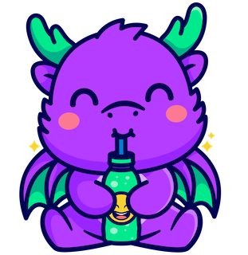

# lolpop
A software engineering framework to jump start your Machine Learning projects



Full documentation can be accessed [here](https://lolpop.readthedocs.io). 
## Installing 

You can install lolpop from PyPI using `pip`: 

```bash
pip install lolpop
```

If you're working in dev mode, you can clone this repo and install lolpop by `cd`'ing to the this directory and executing: 

```bash
poetry install 
```

Welcome to lolpop!

## What is lolpop? 

lolpop is a software engineering framework for machine learning workflows. 

The overarching goal is to provide a framework that can help unify data science and machine learning engineering teams. 
We believe by establishing a standard framework for machine learning work that teams can collaborate more cleanly and be more productive. 

Good system design is critical in software development and lolpop tries to follow the following principles. 
A good system design will contain:  

1. Standard set of logical components
2. Stable APIs for interacting with components 
3. Canonical implementations of components and APIs 
4. Extensibility that allows people to implement their own versions of any component

Furthermore, the following goals were kept in mind when building lolpop: 

1. **Modularity is a first-class design concept**. Design a system where parts can easily be interchanged as needed. 
2. **The system is endlessly extensible**. If you want to code, you can code. Provide a simple process to extend functionality in the system. 
3. **Layers of abstraction provide accessibility**. Layers of abstraction allow users to build workflows without getting lost in implementation details. Users can likewise turn gnarly code into something that others can simply leverage in their own workflows (even without code!).
3. **Provide a declarative experience**. Moving from development workflows to production/automated workflows can often be clumsy in ML. Having a well-trodden path for a declarative experience smooths out the difficulty here. 
4. **Make writing and executing tests on workflows easy**. Things often go off the rails. Design a system that expects failures and makes it easy to test and catch problem before they get into production.
5. **Provide a logical implementation on CI/CD or ML Delivery platform**. Make it easy to be "environment aware" and straightforward integrations into production tooling.  
6. **Enable smart defaults for use case acceleration**. Provide standard components to begin building workflows and allow developers to set recommended defaults for when others want to use their work.  
7. **Make switching fees minimal**. Switching fees prevent teams from doing what is best for them and leadership often balks forcing change. We wanted to make it easy to switch to new tech, and also easy to bring existing workloads into lolpop. Bringing in an existing workload should be a lightweight refactoring exercise.
8. **Open source**. Forever and ever. 
9. **Be unopinionated about almost everything else**. Being opinionated forces users to adopt less flexible systems. We want to be as flexible as possible within these guiding principles. 

## Key Concepts

lolpop has a relatively flat conceptual model which contains three main resources to understand: 

- **Components**: the core integration in lolpop. These are integrations that directly work with external libraries to introduce some functionality into workflows, such as: training a model, transforming data, encoding features, versioning resources, etc. 
- **Pipelines**: perform actions across one or more components to accomplish parts of a workflow. For example, a *model training* pipeline might have a method `train_model`. This method would know how to take incoming data, train a model or set of models, version those models, and return the winning model. This method would work across several components, such as a feature encoder, model trainer, hyperparameter tuner, metadata tracker, and resource version control system. 
- **Runners**: coordinate the actions in a pipeline and can also work across pipelines, when necessary. As pipelines are independent, the main way to coordinate between pipelines would be at the runner level of the hierarchy. Runners are expected to be use case-dependent. I.E. a *training pipeline* (and associated components) may be abstract enough to work across use cases, such as classification, regression, time-series forecasting, etc., but the runner between these use cases will likely be different as it will need to coordinate actions differently for each. Methods in runners typically execute an end-to-end workflow. 

Components, pipelines, and runners have many common traits. We use the term **integration** when referring to the set of components, pipelines, and runners. 

There is also a natural hierarchy between components, pipelines, and runners: 

1. Runners can have children pipelines and components.
2. Pipelines can have children components.

## How does it work?

lolpop has a straightforward development workflow. We hope all find it delightful to use! 

First: write your own components or use [pre-built](https://lolpop.readthedocs.io/en/latest/extensions/) ones: 

```python title="catboost_model_trainer.py"
from lolpop.comonent import BaseComponent 
from catboost import CatBoostRegressor, CatBoostClassifier

class CatboostModelTrainer(BaseComponent): 

    def __init__(problem_type=None, params={}, *args, **kwargs): 
        super().__init__(*args, **kwargs)

        if problem_type == "classification": 
            self.model = CatBoostClassifier(**params)
        elif problem_type == "regression": 
            self.model = CatBoostRegressor(**params)

    def fit(self, data, *args, **kwargs):
        self.model.fit(data["X_train"], data["y_train"])

        return self.model

    ... 
```

Components can then be leveraged in pipeline and runner workflows. Instead of referring to specific component classes, these workflows are designed to use generic component types, as shown below. 

```python title="my_training_pipeline.py"
from lolpop.pipeline import BasePipeline

class MyTrainingPipeline(BasePipeline): 
    ... 

    def train_model(self, data, *args, **kwargs): 

        model = self.model_trainer.train_model(data)

        return model    
    
    ...

```

We then configure which classes to use in our pipeline and runner configuration, as shown below: 
```yaml title="dev.yaml"
#runner config
pipeline: 
  train: MyTrainingPipeline
...

#pipelines config
train: 
  component: 
    model_trainer: CatBoostTrainer
  model_trainer: 
    config: 
        training_params: 
            iterations: 2 
            depth: 2 
            learning_rate: 1 
            loss_function: RMSE
...

```

Finally, workflows can either be invoked via python code: 

```python 
from lolpop.extension import MyRunner

config_file = "/path/to/dev.yaml"

runner = MyRunner(conf=config_file)

...

model = runner.train.train_model(data)

... 
```

or via the lolpop cli: 

```bash
lolpop run workflow MyRunner --config-file /path/to/dev.yaml
```

If you're interested in building out your own workflows, it's a good idea to look into some of the provided [examples](https://lolpop.readthedocs.io/en/latest/examples/) and also look into the [extensiblity framework](https://lolpop.readthedocs.io/en/latest/extensions/)

## Why lolpop?

We've long felt that the ML ecosystem lacked a tool to act as the glue between all the various things that one needs to do in order to successfully execute a production use case. lolpop is an attempt to bridge that gap -- to be that glue. For more information regarding the inspiration behind lolpop, please read our launch [blog](https://medium.com/@jordan_volz/introducing-lolpop-c78581d6ee1f). 

## What is lolpop *not*? 
Sometimes it's helpful to understand what a tool is not in order to fully understand what it is. The description *'software engineering framework for machine learning workflows'* can be a little obtuse, so it might be helpful to understand the following: 

1. **lolpop is not an orchestration tool**. In fact, you should probably use an orchestrator to run code you create with lolpop. You should easily be able to integrate your orchestration tool of choice with lolpop. 

2. **lolpop is not a pipelining tool**. There's several good pipelining tools out there and you even might want to use them with lolpop. For example, we have an example of using [metaflow](integrations/metaflow_offline_train.py) with lolpop, for those who are so inclined.

3. **lolpop is not a metadata tracker, training platform, experiment tacker, etc.** We think you should have and use those if you want to. lolpop will be happy to have those as components and let you build them into your workflows. 

lolpop *doesn't really do anything*, it mainly helps you write better ML workflows, faster. It's unopinionated about what tools you use to do that. 

## Next Steps

- [Quickstart](https://lolpop.readthedocs.io/en/latest/quickstart): Go here for a quickstart guide. Learn how to install lolpop and get it up and running. Run your first workflow, dance, and celebrate!

- [User Guide](https://lolpop.readthedocs.io/en/latest/lolpop_overview): Go here to learn how to work with lolpop. 

- [Integrations](https://lolpop.readthedocs.io/en/latest/integrations): Go here to learn about pre-built runner, pipelines, and components that you can use to build out your own workflows.  

- [Extensions](https://lolpop.readthedocs.io/en/latest/extensions): Go here to learn all you need to do to start building your own runners, pipelines, and components. 

- [CLI](https://lolpop.readthedocs.io/en/latest/cli): Go here to learn how to use the lolpop command line interface. 

- [Examples](https://lolpop.readthedocs.io/en/latest/examples): Go here to find some examples of using lolpop. 

- [Resources](https://lolpop.readthedocs.io/en/latest/about) : Go here to find out how to get in touch with the lolpop team, contributing to lolpop, etc. 

